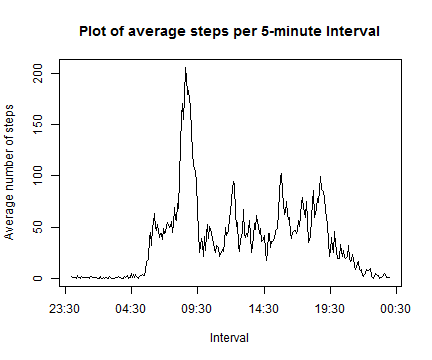
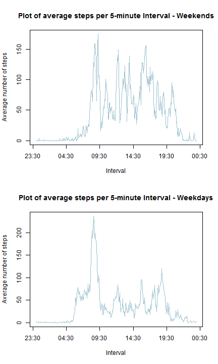

Reproducible Research: Peer Assessment 1
========================================================


This data set includes data recorded by a personal activity monitoring device. The number of steps taken by the subject was recorded in 5 minute intervals for 61 days. The data set includes the following variables:

* steps: The number of steps taken by the individual in a given 5 minute interval, as measured by a personal activity monitoring device.
* date: The date on which the measurement was taken (YYYY-MM-DD format)
* interval: A number identifying the 5-minute interval when the measurement was taken, from 0 (12:00am - 12:05am) to 2355 (11:55pm - 12:00am).


## Data Processing

After reading the data set into **R**, we should first look at the structure of the dataset.


```r
# Read in data
activity <- read.csv('activity.csv')

str(activity)
```

```
## 'data.frame':	17568 obs. of  3 variables:
##  $ steps   : int  NA NA NA NA NA NA NA NA NA NA ...
##  $ date    : Factor w/ 61 levels "2012-10-01","2012-10-02",..: 1 1 1 1 1 1 1 1 1 1 ...
##  $ interval: int  0 5 10 15 20 25 30 35 40 45 ...
```


Note that there are some missing values in the dataset, but these will be dealt with later in the project. However, the formats of the dates and intervals will need to be changed.


```r
# Change dates to proper format
activity$date <- as.Date(activity$date)

# Add leading 0s to intervals
activity$interval <- sprintf("%04d",activity$interval)

# Change interval format
activity$interval <- format(strptime(activity$interval, "%H%M"), "%H:%M")
```

Finally, we will want to include the day of the week into our data set. 


```r
# Add week day to data set
activity$day <- weekdays(activity$date)
```


## Question 1: What is mean total number of steps taken per day?

To answer this question, we begin by creating a histogram of the total number of steps taken per day. 


```r
library(ggplot2)

# Aggregate data to get the sum of steps by date
activityq1 <- aggregate(activity$steps, list(activity$date), sum)
names(activityq1) <- c("date", "steps")

# Create histogram

ggplot(activityq1, aes(x=steps)) + geom_histogram(colour="black", fill="lightblue3", binwidth=2000)+xlab("Total Steps per Day") + ylab("Number of Days") + ggtitle("Histogram of Number of Steps per Day")
```

 


```r
summary(activityq1$steps, na.rm=TRUE)
```

```
##    Min. 1st Qu.  Median    Mean 3rd Qu.    Max.    NA's 
##      41    8840   10800   10800   13300   21200       8
```

From the data summary, we can see that the **mean** number of steps is 10800 per day and the **median** is 10800 steps.

It is interesting to note that the **minimum number** of steps was 41. We do not know whether this is an error or not - the subject could have been very sick in bed, or perhaps left the sensor on a table by accident. 


## Question 2: What is the average daily activity pattern?

We are now interested in finding out the times of the day when our subject was most active. The following plot displays the mean number of steps in each 5 minute interval, averaged over all days.


```r
# Aggregate data to get average number of steps by interval
activityq2 <- aggregate(activity$steps, list(activity$interval), mean, na.rm=TRUE)
names(activityq2) <- c("interval", "avgSteps")

# Create a plot

with(activityq2, plot(as.POSIXct(interval, format="%H:%M"), avgSteps, type='l', main="Plot of average steps per 5-minute Interval", xlab="Interval", ylab="Average number of steps"))
```

 

It looks like there are activity spikes in the morning, at lunch, after work or school and later in the evening. We can also see that a low number of steps occur at night when the subject is presumably sleeping. 


```r
maxSteps <- with(activityq2, interval[which(avgSteps==max(avgSteps))])
maxSteps
```

```
## [1] "08:35"
```

The interval with the highest average number of steps occurs at 08:35 in the morning. 


## Question 3: Imputing missing values

There are some missing values in our data set that we want to fill in. One option would be to use the average for each interval, calculated in the previous question. However, first we should check whether there is a big difference between week days.


```r
activityq1$day <- weekdays(activityq1$date)

dayAvgs <- with(activityq1[!is.na(activityq1$steps),], aggregate(steps, list(day), mean), na.rm=TRUE)

names(dayAvgs) <- c("day", "avgSteps")

dayAvgs
```

```
##         day avgSteps
## 1    Friday 12359.71
## 2    Monday  9974.86
## 3  Saturday 12535.43
## 4    Sunday 12277.71
## 5  Thursday  8212.75
## 6   Tuesday  8949.56
## 7 Wednesday 11790.75
```

There goes seem to be quite a large difference between days, so therefore we will estimate the missing values using both the interval and the day of the week. 


```r
# Calculate averages by interval and weekday
stepEst <- aggregate(activity$steps, list(activity$interval,activity$day), mean, na.rm=TRUE)
 names(stepEst)<- c("interval", "day", "avg")
   
# add a new column to the activity data frame  
activity$steps_clean <- activity$steps  
  
# replace all NA values with the corresponding average
for(i in 1:nrow(activity)){
    if(is.na(activity$steps[i])){
    	activity$steps_clean[i] <- stepEst[stepEst$interval == activity$interval[i] & stepEst$day == activity$day[i],]$avg
	} 
}	
```


Now we create a histogram with this new cleaned data. We can see that most of the new values have been added to the middle of the distribution, as we might expect.


```r
# Aggregate data to get the sum of steps by date
activityq3 <- aggregate(activity$steps_clean, list(activity$date), sum)
names(activityq3) <- c("date", "steps")

# Create histogram

ggplot(activityq3, aes(x=steps)) + geom_histogram(colour="black", fill="goldenrod2", binwidth=2000)+xlab("Total Steps per Day") + ylab("Number of Days") + ggtitle("Histogram of Number of Steps per Day")
```

 


```r
summary(activityq3$steps)
```

```
##    Min. 1st Qu.  Median    Mean 3rd Qu.    Max. 
##      41    8920   11000   10800   12800   21200
```

How does this affect our mean and median? While our mean stays about the same, the median increases from 10800 to 11000. 


## Question 4: Are there differences in activity patterns between weekdays and weekends?

To answer this question, we will need to add a factor variable to our data set that determines whether a day falls on the weekend or is during the week.  


```r
activity$weekend <- sapply(activity$day, function(x){if(x == "Saturday" || x == "Sunday"){return("weekend")} else {return("weekday")}})  
```


```r
activityq4_wkd <- with(activity[activity$weekend=="weekend",], aggregate(steps_clean, list(interval), mean))

names(activityq4_wkd)<- c("interval", "avgSteps")

activityq4_wdy <- with(activity[activity$weekend=="weekday",], aggregate(steps_clean, list(interval), mean))

names(activityq4_wdy)<- c("interval", "avgSteps")

par(mfrow=c(1,2))

with(activityq4_wkd, plot(as.POSIXct(interval, format="%H:%M"), avgSteps, type='l', main="Plot of average steps per 5-minute Interval - Weekends", xlab="Interval", ylab="Average number of steps", col="lightblue3"))

with(activityq4_wdy, plot(as.POSIXct(interval, format="%H:%M"), avgSteps, type='l', main="Plot of average steps per 5-minute Interval - Weekdays", xlab="Interval", ylab="Average number of steps", col="lightblue3"))
```

 

From these plots, it does look like there are differences between weekend and weekday walking patterns. On weekdays, it looks like the subject has a more structured day, which includes more activity in the mornings, lunch time and evenings. On weekends the subject moves around more freely. It looks like he or she also might stay in bed longer on the weekends. 


